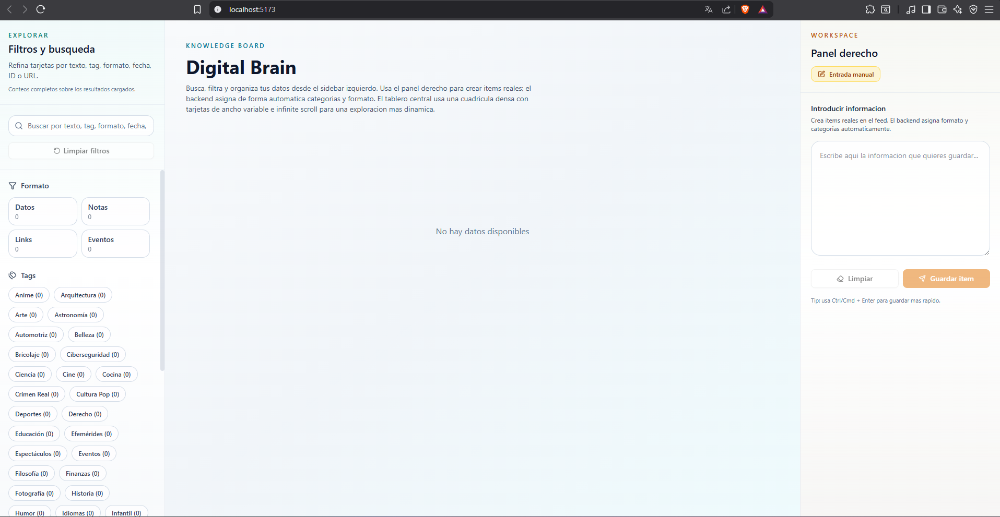
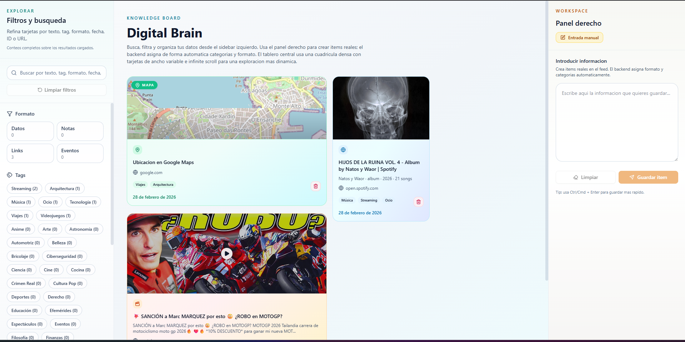
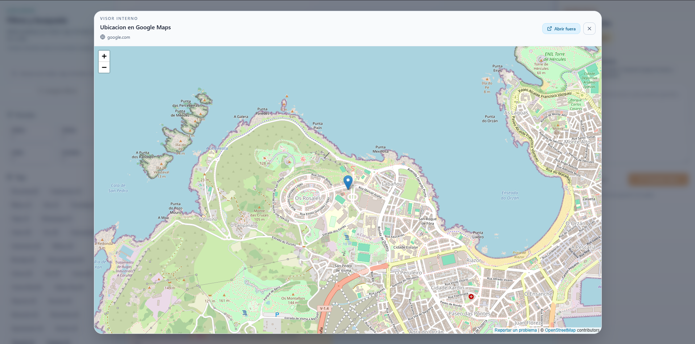

# 🧠 Kelea Digital Brain: H4ck-2026

> **Solución al reto "Digital Brain" de Kelea** > Un sistema de documentación personal (*unified inbox*) diseñado para capturar, procesar y transformar el flujo constante de información diaria en conocimiento estructurado, reduciendo la fricción cognitiva y sin interrumpir tu flujo de trabajo.

---

## 🌟 La Propuesta de Valor

**H4ck-2026** aborda el desafío de la sobrecarga informativa mediante una arquitectura inteligente que separa radicalmente la **fase de captura** (donde la velocidad es vital) de la **fase de procesamiento** (donde la automatización añade valor).

### Resolviendo el Core Challenge
* **Frictionless Capture:** Un panel lateral siempre disponible permite el volcado rápido de ideas (texto, enlaces o notas de audio) sin abandonar la vista principal.
* **Knowledge Transformation:** El backend actúa como un "cerebro digital" que analiza la entrada en bruto, extrayendo metadatos y transformando enlaces caóticos en tarjetas ricas en contexto.
* **Structure & Coherence:** Organización automatizada mediante un sistema de auto-etiquetado (tags) y clasificación por formatos.

### Capas Adicionales (Optional Layers)
* **Integrated Automation:** Asignación automática de categorías y formatos visuales (`web`, `video`, `location`, `reel`, `social`) sin intervención manual.
* **Clear Added Value:** Visores internos integrados (ej. visor de mapas) que permiten consumir el contenido guardado sin salir de la plataforma, manteniendo el foco del usuario.

---

## 📸 Experiencia de Usuario e Interfaz

### Dashboard Principal (Knowledge Board)
El tablero central utiliza una cuadrícula densa con tarjetas de ancho variable y *infinite scroll* para una exploración dinámica. El diseño garantiza que el usuario pueda filtrar por texto, etiqueta, formato o fecha rápidamente.



### Captura Inteligente y Enriquecimiento
Al introducir datos (como un enlace de Spotify, un vídeo de YouTube o una ubicación) en la "Entrada manual", el backend procesa asíncronamente la información para generar previsualizaciones ricas.



### Visores Contextuales Integrados
Para evitar distracciones y la apertura de múltiples pestañas, el sistema detecta tipos de contenido específicos y ofrece visores nativos. Por ejemplo, las ubicaciones se abren en un mapa interactivo interno.



---

## 🛠 Arquitectura y Stack Tecnológico

El proyecto está diseñado bajo una arquitectura de microservicios para garantizar robustez, escalabilidad y control total sobre los datos:

* **Frontend:** React (Vite) para una interfaz reactiva, rápida y fluida.
* **Backend:** FastAPI (Python), aprovechando su rendimiento asíncrono para el procesamiento inteligente y la recolección de metadatos.
* **Persistencia:** PostgreSQL, asegurando la integridad relacional y el almacenamiento estructurado.
* **Infraestructura:** Docker y Docker Compose, garantizando paridad absoluta entre entornos.

---

## 🚀 Despliegue del Sistema (Docker)

El proyecto incluye configuraciones listas para usar tanto para desarrollo iterativo como para simulación de producción.

### 1. Stack de Desarrollo (Local)
Optimizado para la iteración rápida. Utiliza *live-reload* tanto en el backend como en el frontend (HMR).

**Desplegar:**
```bash
docker compose -f docker-compose.yml -f docker-compose.local.yml up -d --build
```

**Endpoints de Servicios:**

* **Frontend:** `http://localhost:5173`
* **Backend Health Check:** `http://localhost:8000/healthz`
* **PostgreSQL:** `localhost:5432`

**Detener:**

```bash
docker compose -f docker-compose.yml -f docker-compose.local.yml down
```

### 2. Stack de Producción (Production-style)

Simula un entorno de despliegue real. Construye el frontend estático utilizando **Nginx**, el cual sirve los *assets* y actúa como reverse-proxy (`/api/*`) hacia el backend.

**Desplegar:**

```bash
docker compose -f docker-compose.yml -f docker-compose.prod.yml up -d --build
```

**Endpoints de Servicios:**

* **Frontend (Nginx):** `http://localhost`
* **Proxied Backend Health:** `http://localhost/api/healthz`


## 🧠 Lógica de Negocio y Automatización

### Frontend: Creación de Ítems sin Fricción
* El panel derecho de Entrada crea ítems reales enviando peticiones a `POST /items/`.
* **Cero Carga Cognitiva:** El frontend envía exclusivamente el contenido introducido por el usuario. El backend asume toda la responsabilidad de asignar el formato correspondiente y procesar automáticamente las categorías y etiquetas.

### Database Seeding (Autoconfiguración)
Para facilitar la evaluación y el desarrollo, la base de datos se autoconfigura al iniciar el backend (una vez que la BD está *healthy*):

* Pregenera datos hasta alcanzar **50 categorías activas**.
* Los enlaces sembrados utilizan URLs de documentación reales y accesibles (se han eliminado las rutas sintéticas `/resource/...`).


### Resiliencia de Enlaces (Link Preview Behavior)
El sistema está diseñado para lidiar con el deterioro de la web (*link rot*). Cuando se solicita la previsualización de un enlace mediante `GET /items/{item_id}/link-preview`, si la URL almacenada devuelve un error `404` del servidor de origen, el backend implementa una estrategia de reintento automático contra la página principal (homepage) del dominio, mejorando significativamente la resiliencia frente a enlaces obsoletos.

---
*Desarrollado para el reto Kelea Digital Brain - 2026*